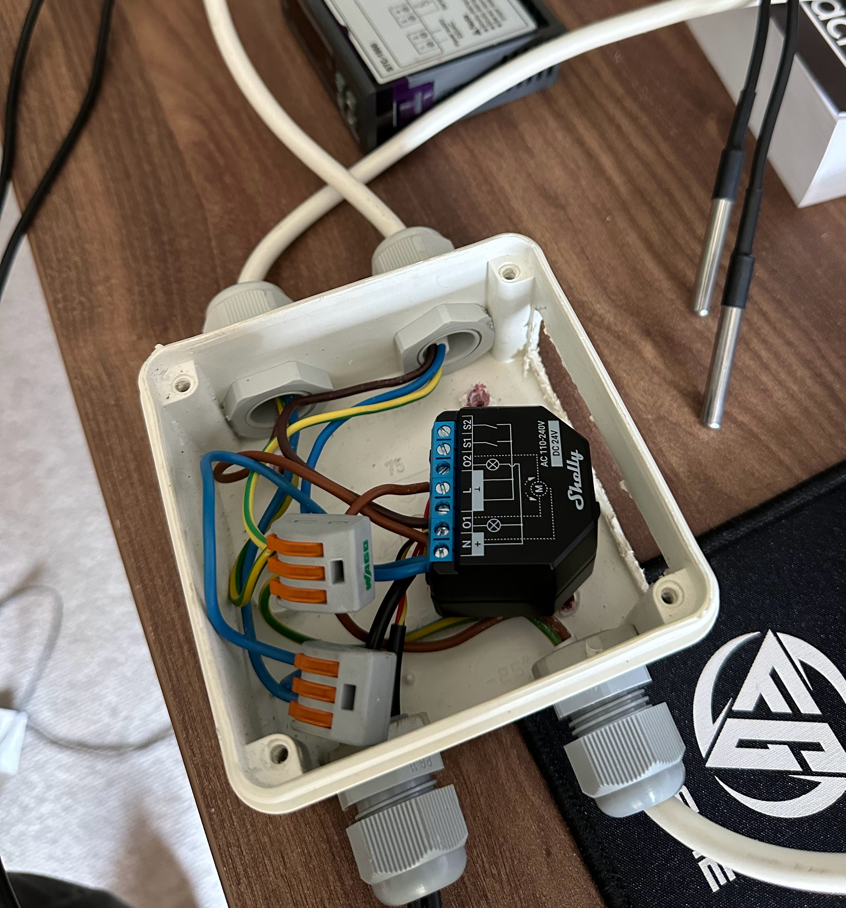

# Automated fermentation

⚠️ This guide is work-in-progress ⚠️

This guide will walk you through how to accomplish a fully automated multi-step fermentation using this Node-RED library along with a few other. 
It is assumed that you are already familiar with Node-RED, if not I suggest you read up on that before.

We will be using the following Node-RED libraries:
* [Temperature Controller](https://flows.nodered.org/node/@pakerfeldt/node-red-contrib-temperature-controller) - Our software thermostat. For those of you familiar with STC-1000 or Inkbird, this is our software version of that. You will need hardware as well, more about that in a bit!
* [Adaptive Temperature](https://flows.nodered.org/node/@pakerfeldt/node-red-contrib-adaptive-temperature) - Takes desired target temperature, and two temperature readings and produces a smoothened temperature.
* [Fermentation Controller](https://flows.nodered.org/node/@pakerfeldt/node-red-contrib-fermentation-controller) - This node is responsible for executing your fermentation schedule.
* [Shelly](https://flows.nodered.org/node/node-red-contrib-shelly) - Node for communicating with Shelly devices.

# Hardware
We are going to use a Shelly Plus 2PM + Shelly Plus Addon + 2 Shelly Temperature Sensors. The sensors are connected to the Shelly Plus Addon which in turn is attached to the Shelly Plus 2PM.
The 2PM has two channels, where one is used for cooling and one for heating. Connect each channel to an output socket. Always consult with electrician!
For gravity readings, we are going to use an iSpindel that communicates over MQTT which Node-RED has built-in support for. 



One sensor probe will be positioned somewhere inside the refrigerator to measure ambient temperature. The other probe should be positioned for reading the temperature in your fermentation
vessel, through for example a thermowell. If this is not possible, you can use the temperature readings from iSpindel or any other way you see fit.

# Hooking up Shelly

​Add the Shelly devices to your network by using their mobile app, but do not add them as a "Thermostat" since we will be using Temperature Controller in Node-RED as our thermostat.
Each of the two channels will become its own device in Shelly and you add one temperature sensor to each of these two devices.
For both of these deices, enable MQTT in the Shelly app and configure it to your MQTT broker. Ensure `Generic status update over MQTT` is enabled. Enabling MQTT is not strictly necessary as there are other methods to get temperature readings.

# Hooking up iSpindel
It's not strictly necessary to connect an iSpindel. You can still automate a fermentation schedule by using days, but you cannot use gravity goals
to transition between steps in your fermentation schedule. If you want to acheive that, you need to get iSpindel readings into Node-RED. One way
of doing this is to connect it to your MQTT broker. Refer to iSpindel documentation on how to do that.

## Brewfather
Worried about not getting readings to Brewfather when changing to MQTT? Don't worry, you can create a very small flow in Node-RED that takes your readings from MQTT and forwards them to Brewfather as if the iSpindel was directly connected.

# Node-RED

Install the four libraries to your Node-RED instance.

Our flow is going to look something like this:

* Ambient temperature should subscribe to the MQTT topic for your ambient temperature sensor. In my case, it's `shellyplus2pm-d12bfd79a188/status/temperature:101`.
* Fermenter temperature should subscribe o the MQTT topic for your fermenter temperature sensor. In my case, it's `shellyplus2pm-d12bfd79a188/status/temperature:100`.
* `as t2` and `as t1` are both `Change` nodes that changes the topic of the message to `t2` and `t1` respectively and sets `msg.payload` to the value of `msg.payload.tC` as given by the Shelly device.
* Shelly Plus 2PM node needs to be connected to your 2PM device. Type in the IP address of your 2PM device in the node configuration.
* `to cooler` and `to heater` are both `Change` nodes that sets the `msg.payload` using the following JSONata expression. `id` is either 0 or 1 depending on which output belongs to the cooler / heater.
```json
{
    "method" : "Switch.Set",
    "parameters" : {
        "id" : 0,
        "on" : msg.payload
    }
}
```
## Activating a fermentation profile
☝️ The process of activating a profile is rather crude at the moment, and needs to be simplified. I.e. how can we easily pass in a fermentation profile without having to access the Node-RED admin interface?
The [Fermentation Controller Readme](https://github.com/pakerfeldt/node-red-contrib-fermentation-controller) describes in detail how to define a profile. For the purpose of this guide, I'm going to use an example profile.

Add an inject node and set `msg.profile` to the JSON:
```json
{
    "expectedFG": 1.007,
    "steps": [
        {
            "targetTemperature": 12,
            "goal": {
                "days": 14,
                "gravity": {
                    "fromFG": 0.01
                }
            }
        },
        {
            "targetTemperature": 16,
            "goal": {
                "days": 1
            }
        },
        {
            "targetTemperature": 17,
            "goal": {
                "days": 1,
                "gravity": {
                    "absolute": 1.007
                }
            }
        },
        {
            "targetTemperature": 0,
            "goal": {
                "days": 3
            }
        }
    ]
}
```
Hopefully this profile is relatively straight-forward. The expected final gravity is 1.007. There are 4 steps in this profile which starts at 12°C (this can ofc be Fahrenheit as long as your thermostat expects °F) for either 14 days or until the specific gravity reaches below or equal to 1.017 (whatever comes first). Then it increases the temperature to 16°C for one day, followed by another °C increase for 1 day or until FG is reached. Finally it goes down to 0°C for cold crash for 3 days.

## Example 1. Simple flow with Shelly

[Download example flow](example-flows/shelly-simple.json)


### Requirements
* [Temperature Controller](https://flows.nodered.org/node/@pakerfeldt/node-red-contrib-temperature-controller)
* [Fermentation Controller](https://flows.nodered.org/node/@pakerfeldt/node-red-contrib-fermentation-controller)
* [Shelly](https://flows.nodered.org/node/node-red-contrib-shelly)

This is a very simple flow using Shelly for temperature sensor and controlling a heater & cooler. The fermentation schedule will not be able to use gravity to progress fermentation schedule since we don't have gravity readings provided. However, this is a fully functional setup that will get you a long way.

## Example 2. Shelly flow with 2 temperature sensors

[Download example flow](example-flows/shelly-two-sensors.json)


### Requirements
* [Temperature Controller](https://flows.nodered.org/node/@pakerfeldt/node-red-contrib-temperature-controller)
* [Adaptive Temperature](https://flows.nodered.org/node/@pakerfeldt/node-red-contrib-adaptive-temperature)
* [Fermentation Controller](https://flows.nodered.org/node/@pakerfeldt/node-red-contrib-fermentation-controller)
* [Shelly](https://flows.nodered.org/node/node-red-contrib-shelly)

This flow is similar to Example 1 but instead uses two temperature readings. One from your fermentation vessel and one from the ambient air temperature inside the cabinet. Using the `Adaptive Temperature` node, we can allow for smoother transitions inside the cabinet as you go from one temperature to another. If you can measure temperature inside your fermenter, this setup is highly recommended.


